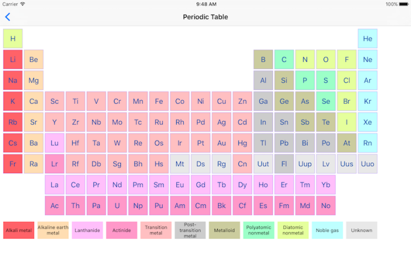
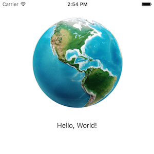
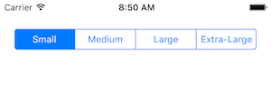

 

# Introduction
MarkupKit is an open-source framework for simplifying development of native iOS and tvOS applications. It allows developers to construct user interfaces declaratively using a human-readable, HTML-like markup language, rather than visually using Interface Builder or programmatically in code. 

For example, the following markup creates an instance of `UILabel` and sets the value of its `text` property to "Hello, World!":

    <UILabel text="Hello, World!"/>

This markup is equivalent to the following Swift code:

    let label = UILabel()
    label.text = "Hello, World!"

Building an interface in markup can significantly reduce development time. For example, the periodic table shown below was constructed using a combination of MarkupKit's layout views and `UILabel` instances:

Creating this view in Interface Builder would be an arduous task. Creating it programmatically would be even more difficult. However, in markup it is almost trivial. The complete source code for this example can be found [here](https://github.com/gk-brown/MarkupKit/blob/master/MarkupKit-iOS/MarkupKitExamples/PeriodicTableViewController.xml).

Using markup also helps to promote a clear separation of responsibility. Most, if not all, aspects of a view's presentation can be specified in the view declaration, leaving the controller responsible solely for managing the view's behavior. 

This guide introduces the MarkupKit framework and provides an overview of its key features. The first section describes the structure of a MarkupKit document and explains how view instances are created and configured in markup. The remaining sections introduce the classes included with the framework and discuss how they can be used to help simplify application development. Extensions to several UIKit classes that enhance the classes' behavior or adapt their respective types for use in markup are also discusssed.

MarkupKit requires either iOS 8 or later or tvOS 10 or later. The latest release can be downloaded [here](https://github.com/gk-brown/MarkupKit/releases). It is also available via [CocoaPods](https://cocoapods.org/pods/MarkupKit).

# Contents
* [Document Structure](#document-structure)
* [MarkupKit Classes](#markupkit-classes)
* [Additional Information](#additional-information)

# Document Structure
MarkupKit uses XML to define the structure of a user interface. The hierarchical nature of XML parallels the view hierarchy of an iOS application, making it easy to understand the relationships between views. 

## Elements
Elements in a MarkupKit document typically represent instances of `UIView` or its subclasses. As elements are read by the XML parser, the corresponding view types are dynamically instantiated and added to the view hierarchy. 

For example, the following markup creates an instance of `LMColumnView` containing a `UIImageView` and a `UILabel`. `LMColumnView` is a MarkupKit-provided subclass of `UIView` that automatically arranges its subviews in a vertical line:

    <LMColumnView>
        <UIImageView image="world.png"/>
        <UILabel text="Hello, World!"/>
    </LMColumnView>

The same result could be achieved programmatically as shown below:

    let columnView = LMColumnView()
    
    let imageView = UIImageView()
    imageView.image = UIImage(named: "world.png")
    
    columnView.addArrangedSubview(imageView)
    
    let label = UILabel()
    label.text = "Hello, World!"
    
    columnView.addArrangedSubview(label)

Although the two examples produce identical results, the markup version is much more concise and easier to read.

MarkupKit adds the following method to the `UIView` class to facilitate construction of a view hierarchy from markup:

    - (void)appendMarkupElementView:(UIView *)view;

This method is called on the superview of each view declared in the document to add the view to its parent. The default implementation does nothing; subclasses must override this method to implement view-specific behavior. For example, `LMColumnView` overrides `appendMarkupElementView:` to call `addArrangedSubview:` on itself. 

Note that if a view's type is defined in a module, the fully qualified class name must be used in the view declaration; e.g.:

    <MyApp.MyCustomView/>

### Untyped Elements
In addition to view instances, elements may also represent untyped data. For example, the text content of a `UISegmentedControl` is specified by its `insertSegmentWithTitle:atIndex:animated:` method. In MarkupKit, this is represented as follows:

    <UISegmentedControl>
        <segment title="Small"/>
        <segment title="Medium"/>
        <segment title="Large"/>
        <segment title="Extra-Large"/>
    </UISegmentedControl>

Each `<segment>` element triggers to a call to the following method, which is also added to `UIView` by MarkupKit:

    - (void)processMarkupElement:(NSString *)tag properties:(NSDictionary<NSString *, NSString *> *)properties;

The element's name, "segment", is passed in the `tag` argument, and a key/value pair representing the "title" attribute is included in the `properties` dictionary. 

As with `appendMarkupElementView:`, the default implementation of `processMarkupElement:properties:` does nothing; subclasses must override it to provide view-specific behavior. For example, `UISegmentedControl` overrides this method to call `insertSegmentWithTitle:atIndex:animated:` on itself. 

## Attributes
Attributes in a MarkupKit document usually represent view properties. For example, the following markup declares an instance of a system-style `UIButton` and sets its `title` property to "Press Me!":

    <UIButton style="systemButton" title="Press Me!"/>

Property values are set using [key-value coding](https://developer.apple.com/library/content/documentation/Cocoa/Conceptual/KeyValueCoding/) (KVC). Type conversions for string, number, and boolean properties are handled automatically by KVC. Other types, such as colors, fonts, images, and enumerations, are handled specifically by MarkupKit and are discussed in more detail below.

MarkupKit adds the following methods to `NSObject` to assist in applying property values:

    - (void)applyMarkupPropertyValue:(nullable id)value forKey:(NSString *)key;
    - (void)applyMarkupPropertyValue:(nullable id)value forKeyPath:(NSString *)keyPath;

Ultimately, these methods delegate to the `setValue:forKey:` method of `NSObject`. However, they allow an implementing class to override the default behavior and perform any necessary translation before the value is actually set (for example, converting a string representation of an enum value to its numeric equivalent).

MarkupKit actually invokes the second method when applying property values. This makes it possible to set properties of nested objects in markup. For example, the following markup creates a button whose title label's `font` property is set to "Helvetica-Bold 32":

    <UIButton style="systemButton" title="Press Me!" titleLabel.font="Helvetica-Bold 32"/>

A few attributes have special meaning in MarkupKit and do not represent properties. These include "style", "class", and "id". Their respective purposes are explained in more detail later.

Additionally, attributes whose names begin with "on" represent control events, or "actions". The values of these attributes represent the handler methods that are called when their associated events are fired. For example, this markup creates a button with an associated action that will be triggered when the button is pressed:

    <UIButton style="systemButton" title="Press Me!" onPrimaryActionTriggered="buttonPressed"/>

Actions are also discussed in more detail below.

### Colors
The value of any attribute whose name is equal to or ends with "color" is converted to an instance of `UIColor` before the property value is set. Colors in MarkupKit may be specified in one of several ways:

* As a hexadecimal RGB[A] value preceded by a hash symbol; e.g. "#ff0000" or "#ffffff66"
* As a named color; e.g. "yellow"
* As a pattern image; e.g. "background.png"

For example, the following markup creates a label whose text color is set to "#ff0000", or bright red:

    <UILabel text="A Red Label" textColor="#ff0000"/>
    
This markup creates a column view whose background color is set to a semi-transparent white:

    <LMColumnView backgroundColor="#ffffff66">
        ...
    </LMColumnView>

#### Named Colors
A named color value may refer to either a color in the application's color table or to a color constant defined by the `UIColor` class. The color table is an optional collection of key-value pairs defined in a file named _Colors.plist_. If present, this file must be located in the application's main bundle. The table's keys represent color names, and the values the associated RGB[A] values. The names can be used thoroughout the application in place of the actual hex values.

For example, the following property list defines a color named "darkRed":

    <plist version="1.0">
    <dict>
        <key>darkRed</key>
        <string>#8b0000</string>
    </dict>
    </plist>

This markup creates an instance of `UILabel` whose text color will be set to the value that "darkRed" refers to in the property list, "#8b0000":

    <UILabel text="A Dark Red Label" textColor="darkRed"/>

Named colors may also refer to the color preset methods of `UIColor`, such as `darkGrayColor`. The value is the name of the accessor method minus the "Color" suffix. 

For example, the following markup would produce a system-style button whose tint color is set to the value returned by the `greenColor` method of `UIColor`:

    <UIButton style="systemButton" tintColor="green"/>

Color table entries take precedence over `UIColor` constants. For example, if _Colors.plist_ defined a value for "green", the corresponding color would be used instead of the value returned by the `greenColor` method.

#### Pattern Images
Pattern images are specified by providing the name of the name of the image to use as a repeating tile. For example, this markup creates a table view with a tiled background image named "tile.png":

    <LMTableView backgroundColor="tile.png">
        ...
    </LMTableView>
    
Images are discussed in more detail below.

### Fonts
The value of any attribute whose name is equal to or ends with "font" is converted to an instance of `UIFont` before the property value is set. Fonts in MarkupKit are specified in one of two ways:

* As an explicitly named font, using the full name of the font followed by a space and the font size
* As a text style; e.g. "body"

For example, the following markup creates a `UILabel` whose font is set to 24-point Helvetica:

    <UILabel text="This is Helvetica 24 text" font="Helvetica 24"/>

The current system font can be specified by using "System" as the font name. "System-Bold" and "System-Italic" are also supported.

#### Text Styles
A text style refers to either an entry in the application's font table or to a system-defined text style. The font table is an optional collection of key-value pairs defined in a file named _Fonts.plist_. If present, this file must be located in the application's main bundle. The table's keys represent style names, and the values the associated fonts. The styles can be used throughout the application in place of the actual font names.

For example, the following property list defines a text style named "monospaced":

    <plist version="1.0">
    <dict>
        <key>monospaced</key>
        <string>Courier 12</string>
    </dict>
    </plist>

This markup creates an instance of `UILabel` whose font will be set to the value that "monospaced" refers to in the property list, "Courier 12":

    <UILabel text="This is monospaced text" font="monospaced"/>

Style names may also refer to system-defined text styles such as `UIFontTextStyleHeadline`. The value is the name of the style constant minus the leading "UIFontTextStyle" prefix, with a leading lowercase letter.

For example, the following markup would produce a label whose font is set to whatever is currently associated with the system's "headline" text style:

    <UILabel text="This is headline text" font="headline"/>

Font table entries take precedence over system style constants. For example, if _Fonts.plist_ defined a value for "headline", the corresponding font would be used instead of the value associated with the `UIFontTextStyleHeadline` constant.
    
### Images
The value of any attribute whose name is equal to or ends with "image" is converted to an instance of `UIImage` before the property value is set. For example, the following markup creates an instance of `UIImageView` and sets the value of its `image` property to an image named "background.png":

    <UIImageView image="background.png"/>

Images are loaded using the `imageNamed:inBundle:compatibleWithTraitCollection:` method of the `UIImage` class. The attribute value is passed as the first argument to the method. If the document's owner (usually the view controller) implements the `bundleForImages` method, the second argument will contain the value returned by this method. Otherwise, the application's main bundle will be used. Finally, if the owner conforms to the `UITraitEnvironment` protocol, the third argument will contain the value returned by the owner's `traitCollection` method. Otherwise, it will be `nil`.

Note that, because images are loaded via `imageNamed:inBundle:compatibleWithTraitCollection:`, image attributes may refer to image sets defined in an asset catalog. For example, if the asset catalog contains an image set named "PrintIcon", the following markup would create a button with a title of "Print" and an icon appropriate for the current device resolution:

    <UIButton style="systemButton" image="PrintIcon" title="Print"/>

### Enumerations
Enumerated types are not automatically handled by KVC. However, MarkupKit provides translations for enumerations commonly used by UIKit. For example, the following markup creates an instance of `UITextField` that displays a clear button only while the user is editing, and presents a software keyboard suitable for entering email addresses:

    <UITextField placeholder="Email Address" 
        clearButtonMode="whileEditing" 
        keyboardType="emailAddress"/>

Enumeration values in MarkupKit are abbreviated versions of their UIKit counterparts. The attribute value is simply the full name of the enum value minus the leading type name, with a lowercase first character. For example, "whileEditing" in the above example corresponds to the `UITextFieldViewModeWhileEditing` value of the `UITextFieldViewMode` enum. Similarly, "emailAddress" corresponds to the `UIKeyboardTypeEmailAddress` value of the `UIKeyboardType` enum. 

Note that attribute values are converted to enum types based on the attribute's name, not its value or associated property type. For example, the following markup sets the value of the label's `text` property to the literal string "whileEditing":

    <UILabel text="whileEditing"/>

### Edge Insets
The `UIView` class allows a caller to specify the amount of space that should be reserved around all of its subviews when laying out its contents. This value is called the view's "layout margins" and is represented by an instance of the `UIEdgeInsets` structure. 

Since edge inset structures aren't natively supported by KVC, MarkupKit provides a shorthand for specifying layout margin values. The "layoutMargins" attribute accepts a single numeric value that will be applied to all of the structure's components.

For example, the following markup creates an instance of `LMTableViewCell` whose top, left, bottom, and right layout margins are set to 20:

    <LMTableViewCell layoutMargins="20">
        ...
    </LMTableViewCell>

Edge inset properties of several other view types can also be specified using this shorthand. For example:

    <UIButton style="systemButton" title="Press Me!" contentEdgeInsets="12"/>

    <UITextView height="240" textContainerInset="7"/>    
    
Additionally, MarkupKit adds properties to these view types that allow edge inset components to be specified individually; for example:

    <UIButton style="systemButton" title="Press Me!" contentEdgeInsetTop="12"/>

These extensions are discussed in more detail later.

### Localization
If an attribute's value begins with "@", MarkupKit attempts to look up a localized version of the value before setting the property. For example, if an application has defined a localized greeting in _Localizable.strings_ as follows:

    "hello" = "Hello, World!";

the following markup will produce an instance of `UILabel` with the value of its `text` property set to "Hello, World!":

    <UILabel text="@hello"/>

If a localized value is not found, the key will be used instead. This allows developers to easily identify missing string resources at runtime.

If the document's owner implements the `bundleForStrings` method, localized string values will be loaded using the bundle returned by this method. Otherwise, they will be loaded using the application's main bundle.

### Data Binding
Attributes whose values begin with "$" represent data bindings. The text following the "$" character represents the key path of a property in the document's owner to which the corresponding view property will be bound. Bindings are bi-directional, such that an update to either the owner or the view property will be automatically reflected in the other.

For example, the following markup binds the _text_ property of a text field to the _name_ property of the owner:

    <UITextField text="$name"/>
 
Bindings must be released before the owner is deallocated as well as any time the document is reloaded (for example, on an orientation change). Bindings are released via a call to `unbindAll`, a method MarkupKit adds to the `UIResponder` class. For example:

    deinit {
        unbindAll()
    }

Note that it may not be possible to establish a two-way binding in all cases. Internally, data binding uses [key-value observing](https://developer.apple.com/library/content/documentation/General/Conceptual/DevPedia-CocoaCore/KVO.html) (KVO) to register and respond to property change events. Although many UIKit types support KVO, not all do. In such cases, the view will still respond to changes in the owner, but the owner will not be automatically updated to reflect changes in the view.

Bindings may also be programmatically established by calling the `bind:toView:withKeyPath:` method MarkupKit adds to the `UIResponder` class. See _UIResponder.h_ for more information.

### Factory Methods
Some UIKit classes can't be instantiated by simply invoking the `new` method on the type. For example, instances of `UIButton` are created by calling `buttonWithType:`, and `UITableView` instances are initialized with `initWithFrame:style:`.

To handle these cases, MarkupKit supports a special attribute named "style". The value of this attribute is the name of a "factory method", a zero-argument class method that produces instances of a given type. MarkupKit adds a number of factory methods to classes such as `UIButton` and `UITableView` to enable these types to be constructed in markup.

For example, the following markup creates an instance of a "system"-style `UIButton` by calling the `systemButton` method MarkupKit adds to the `UIButton` class:

    <UIButton style="systemButton" title="Press Me!"/>

Internally, this method calls `buttonWithType:`, passing a value of `UIButtonTypeSystem` for the `buttonType` argument, and returns the newly created button instance.

The complete set of extensions MarkupKit adds to UIKit types is discussed in more detail later.

### Template Properties
Often, when constructing a user interface, the same set of property values are applied repeatedly to instances of a given type. For example, an application designer may want all buttons to have a similar appearance. While it is possible to simply duplicate the property definitions across each button instance, this is repetitive and does not allow the design to be easily modified later - every instance must be located and modified individually, which can be time consuming and error prone.

MarkupKit allows developers to abstract common sets of property definitions into "templates", which can then be applied by name to individual view instances. This makes it much easier to assign common property values as well as modify them later.

Property templates are specified using [JavaScript Object Notation](http://www.json.org) (JSON), and may be either inline or external. Inline templates are defined within the markup document itself, and external templates are specified in a separate file.

Each template is represented by a dictionary object defined at the top level of the JSON document. The dictionary's key represents the name of the template, and its contents represent the property values that will be set when the template is applied. 

For example, the following JSON document defines a template named "greeting", which contains definitions for "font" and "textAlignment" properties:

    {
        "greeting": {
            "font": "Helvetica 24", 
            "textAlignment": "center"
        }
    }

Templates are added to a MarkupKit document using the `properties` processing instruction (PI). The following PI adds all properties defined by _Styles.json_ to the current document:

    <?properties Styles?>

If the document's owner implements the `UITraitEnvironment` protocol, any size class-specific property overrides (e.g. _Styles~horizontal.json_) will also be added to the document. Size class-specific properties are discussed in more detail later.

Inline templates simply embed the entire template definition within the processing instruction:

    <?properties {
        "greeting": {
            "font": "Helvetica 24", 
            "textAlignment": "center"
        }
    }?>

Inline templates are generally used when a set of properties are only applicable to the current document, and external templates are used when the properties may be shared by multiple documents. External templates are cached so that their contents do not need to be reloaded each time they are referenced.

Multiple `properties` PIs may be specified in a single document. Their contents are merged into a single collection of templates available to the document. If the same template is defined by multiple template specifications, the contents of the templates are merged into a single dictionary. The most recently defined values take precedence.

#### Applying Templates
Templates are applied to view instances using the reserved "class" attribute. The value of this attribute refers to the name of a template defined within the current document. All property values defined by the template are applied to the view. Nested properties, such as "titleLabel.font", are supported.

For example, given the preceding template definition, the following markup would produce a label reading "Hello, World!" in 24-point Helvetica with horizontally centered text:

    <UILabel class="greeting" text="Hello, World!"/>

Multiple templates can be applied to a view using a comma-separated list of template names; for example:

    <UILabel class="bold, red" text="Bold Red Label"/>

Note that, although attribute values in XML are always represented as strings, the property values in a template definition can be any valid type; for example, if a property accepts a numeric type, the value can be defined as a number in the JSON document. However, this is not stricly necessary since strings will automatically be converted to the appropriate type by KVC.

### Outlets
The reserved "id" attribute can be used to assign a name to a view instance. This creates an "outlet" for the view that makes it accessible to calling code. Using KVC, MarkupKit "injects" the named view instance into the document's owner (generally either the view controller for the root view or the root view itself), allowing the application to interact with it.

For example, the following markup declares a table view containing a `UITextField`. The text field is assigned an ID of "textField":

    <LMTableView>
        <LMTableViewCell>
            <UITextField id="textField" placeholder="Type something"/>
        </LMTableViewCell>
    </LMTableView>

The owning class might declare an outlet for the text field in Objective-C like this:

    @property (nonatomic) IBOutlet UITextField *textField;
    
or in Swift, like this:

    @IBOutlet var textField: UITextField!

In either case, when the document is loaded, the outlet will be populated with the text field instance, and the application can interact with it just as if it was defined in a storyboard or created programmatically. Note that the `IBOutlet` annotation used by Interface Builder to tag outlet properties is supported by MarkupKit, but is not required.

### Actions
Most non-trivial applications need to respond in some way to user interaction. UIKit controls (subclasses of the `UIControl` class) fire events that notify an application when such interaction has occurred. For example, the `UIButton` class fires the `UIControlEventPrimaryActionTriggered` event when a button instance is tapped.

While it would be possible for an application to register for events programmatically using outlets, MarkupKit provides a more convenient alternative. Any attribute whose name begins with "on" (but does not refer to a property) is considered a control event. The attribute value represents the name of the action that will be triggered when the event is fired. The attribute name is simply the "on" prefix followed by the name of the event, minus the "UIControlEvent" prefix.

For example, the following markup declares an instance of `UIButton` that calls the `buttonPressed:` method of the document's owner when the button is tapped:

    <UIButton style="systemButton" title="Press Me!" onPrimaryActionTriggered="buttonPressed:"/>

For example:

    @IBAction func buttonPressed(_ sender: UIButton) {
        // User tapped button
    }

Note that the `sender` argument is optional; if the trailing colon is omitted from the handler name, the event will trigger a call to a zero-argument handler method:

    @IBAction func buttonPressed() {
        // User tapped button
    }

Like `IBOutlet`, MarkupKit supports the `IBAction` annotation used by Interface Builder, but does not require it.

## Includes
Includes allow content defined in another markup document to be "included" or "imported" into the current document. They enable the structure of a user interface to be modularized; for example, to break up a complex document into smaller, more manageable pieces.

Includes are specified using the `include` processing instruction. The PI's data value represents the name of the document to include. For example, the following processing instruction would import a document named _FirstRow.xml_ into the current document:

    <LMColumnView>
        <?include FirstRow?>
        ...
    </LMColumnView>

The content of the included document is handled the same as if it had been defined inline within the parent document. The include's root view is appended to the view instance containing the PI, and all outlets and actions defined by the include are assigned to the parent's owner. Property templates defined by the parent document are visible to includes, but templates defined by an include are only visible to the include itself (as well as to any nested includes).

Includes are often used to create size class-specific layouts. The common elements of a user interface are defined in a parent document, while elements that are specific to a particular form factor or orientation are delegated to one or more includes.

For example, given the following markup, a document named _SecondRow~horizontal.xml_ would be loaded on a device that is currently presenting a regular width and compact height:

    <LMColumnView>
        ...
        <?include SecondRow?>
    </LMColumnView>

However, if the device was presenting a compact width and regular height, the document named _SecondRow~vertical.xml_ would be loaded instead.

Size class-specific layouts are discussed in more detail later.

## Conditional Processing
In most cases, a markup document created for an iOS application can be used as is in tvOS. However, because not all UIKit types and properties are supported by tvOS, MarkupKit provides support for conditional processing. Using the `case` processing instruction, a document can conditionally include or exclude content based on the target operating system. Content following the PI will only be processed if the current OS matches the target. For example:

    <?case iOS?>
        <!-- iOS-specific content -->
    <?case tvOS?>
        <!-- tvOS-specific content -->
    <?end?>

The optional `end` PI terminates a case. If unspecified, OS-specific processing will continue until the end of the document is reached.

## View-Specific Processing Instructions
In addition to the document-wide `properties` and `include` directives discussed earlier, MarkupKit also provides support for view-specific processing instructions. These allow developers to pass additional information to a view instance that can't be easily expressed as an attribute value or sub-element. 

MarkupKit adds a `processMarkupInstruction:data:` method to the `UIView` class to facilitate PI handling at the view level. For example, `LMTableView` overrides this method to support section header and footer view declarations and section breaks:

    <LMTableView style="groupedTableView">
        <?sectionHeaderView?>
        <UITableViewHeaderFooterView textLabel.text="Section 1"/>        
        
        ...
    </LMTableView>
    
These processing instructions and others are discussed in more detail below.

# MarkupKit Classes
The remaining sections of this document discuss the classes included with the MarkupKit framework:

* `LMViewBuilder` - processes a markup document, deserializing its contents into a view hierarchy that can be used by an iOS application
* `LMTableView`/`LMTableViewCell` - `UITableView` and `UITableViewCell` subclasses, respectively, that facilitate the declaration of table view content
* `LMTableViewController` - `UITableViewController` subclass that simplifies management of an `LMTableView`
* `LMCollectionView`/`LMCollectionViewCell` - `UICollectionView` and `UICollectionViewCell` subclasses, respectively, that facilitate declaration of collection view content
* `LMPickerView` - `UIPickerView` subclass that facilitates the declaration of picker view content
* `LMScrollView` - subclass of `UIScrollView` that automatically adapts to the size of its content
* `LMPageView` - subclass of `UIScrollView` that facilitates the declaration of paged content
* `LMRowView` and `LMColumnView` - layout views that arrange subviews in a horizontal or vertical line, respectively
* `LMSpacer` - view that creates flexible space between other views
* `LMLayerView` - layout view that arranges subviews in layers, like a stack of transparencies
* `LMAnchorView` - view that optionally anchors subviews to one or more edges
* `LMLinearGradientView` and `LMRadialGradientView` - views that facilitate the declaration of linear and radial gradient effects, respectively
* `LMPlayerView` - view that presents an AV player

Extensions to several UIKit classes that enhance the classes' behavior or adapt their respective types for use in markup are also discusssed.

## LMViewBuilder
`LMViewBuilder` is the class that is actually responsible for loading a MarkupKit document. It provides the following class method, which, given a document name, owner, and optional root view, deserializes a view hierarchy from markup:

    + (UIView *)viewWithName:(NSString *)name owner:(nullable id)owner root:(nullable UIView *)root;

### Document Name and Owner
The `name` parameter represents the name of the view to load. It is the file name of the XML document containing the view declaration, minus the _.xml_ extension.

The `owner` parameter represents the view's owner. It is often an instance of `UIViewController`, but this is not strictly required. For example, custom table and collection view cell types often specify themselves as the owner.

If the owner implements the `UITraitEnvironment` protocol, `viewWithName:owner:root:` will first look for an XML document corresponding to the owner's size class; for example, _LoginViewController~horizontal.xml_. Size classes are named as follows:

* Regular width, regular height - "normal"
* Regular width, compact height - "horizontal"
* Compact width, regular height - "vertical"
* Compact width, compact height - "minimal"

If a size class-specific document is not found, `LMViewBuilder` will fall back to the default document name (e.g. _LoginViewController.xml_).

Further, `LMViewBuilder` will apply any size class-specific property templates to the current document. For example, if a document imports a template collection as follows:

    <?properties Styles?>
    
`LMViewBuilder` will first load any properties defined in _Styles.json_, then any properties defined by the template document corresponding to the owner's size class, if present (e.g. _Styles~horizontal.json_). This allows an application to define properties that apply only to a particular size class as well as override values specified in the default template, if desired.

Note that neither size class-specific layouts nor template properties are automatically applied when the owner's size class changes. The application is responsible for reloading the document as needed; for example:

    override func traitCollectionDidChange(previousTraitCollection: UITraitCollection?) {
        super.traitCollectionDidChange(previousTraitCollection)
    
        if (previousTraitCollection != nil) {
            loadView()
            viewDidLoad()
        }
    }
    
If the owner implements the `bundleForView` method, view documents will be loaded from the bundle returned by this method. Otherwise, they will be loaded from the application's main bundle. Note that property templates and color and font tables are always loaded from the application's main bundle.

### Document Root
The `root` parameter represents the value that will be used as the root view instance when the document is loaded. This value is often `nil`, meaning that the root view will be specified by the document itself. However, when non-`nil`, it means that the root view is being provided by the caller. In this case, the reserved `<root>` tag can be used as the document's root element to refer to this view.

For example, if an instance of `LMScrollView` is passed as the `root` argument to `viewWithName:owner:root:`, this markup:

    <root>
        <UIImageView image="world.png"/>
    </root>

is equivalent to the following markup:

    <LMScrollView>
        <UIImageView image="world.png"/>
    </LMScrollView>    

The `root` argument is typically used when a document's root view is defined by an external source. For example, a view controller that is instantiated programmatically typically creates its own view instance in `loadView`. It defines the view entirely in markup, passing a `nil` value for `root`:

    override func loadView() {
        view = LMViewBuilder.view(withName: "ViewController", owner: self, root: nil)
    }

However, a view controller that is defined by a storyboard already has an established view instance when `viewDidLoad` is called. The controller can pass itself as the view's owner and the value of its `view` property as the `root` argument:

    override func viewDidLoad() {
        super.viewDidLoad()

        LMViewBuilder.view(withName: "ViewController", owner: self, root: view)
    }

This allows the navigational structure of the application (i.e. segues) to be defined in a storyboard, but the content of individual views to be defined in markup.

The `root` argument is also commonly used when implementing custom table or collection view view cells. In this case, the cell instance passes itself as both the owner and the root when loading the view: 

    override init(style: UITableViewCellStyle, reuseIdentifier: String?) {
        super.init(style: style, reuseIdentifier: reuseIdentifier)

        LMViewBuilder.view(withName: "CustomTableViewCell", owner: self, root: self)
    }

### Color and Font Values
`LMViewBuilder` additionally defines the following two class methods, which it uses to decode color and font values:

    + (UIColor *)colorValue:(NSString *)value;
    + (UIFont *)fontValue:(NSString *)value;

These methods may also be called by application code to translate MarkupKit-encoded color and font values to `UIColor` and `UIFont` instances, respectively.

See _LMViewBuilder.h_ for more information.

## LMTableView and LMTableViewCell
The `LMTableView` and `LMTableViewCell` classes facilitate the declaration of table view content in markup. `LMTableView` is a subclass of `UITableView` that acts as its own data source and delegate, serving cells from a statically defined collection of table view sections. An `LMTableView` instance is configured to use self-sizing cells by default, allowing it to be used as a general-purpose layout device.

`LMTableViewCell` is a subclass of `UITableViewCell` that provides a vehicle for custom cell content. It automatically applies constraints to its content to enable self-sizing behavior. MarkupKit also provides extensions to the standard `UITableViewCell` class that allow it to be used in markup. This is discussed in more detail in a later section.

### Declaration
`LMTableView` provides two factory methods that are used to construct new table view instances in markup:

    + (LMTableView *)plainTableView;
    + (LMTableView *)groupedTableView;

For example, the following markup creates a "plain"-style table view containing three rows:

    <LMTableView style="plainTableView">
        <UITableViewCell textLabel.text="Row 1"/>
        <UITableViewCell textLabel.text="Row 2"/>
        <UITableViewCell textLabel.text="Row 3"/>
    </LMTableView>
    
Note that, by default, grouped table views enable self-sizing behavior for section headers and footers, but plain table views do not.

### Section Management
The `sectionBreak` processing instruction inserts a new section in a table view. It corresponds to a call to the `insertSection:` method of the `LMTableView` class. This markup creates a grouped table view containing two sections (the first section is created implicitly):

    <LMTableView style="groupedTableView">
        <UITableViewCell textLabel.text="Row 1a"/>
        <UITableViewCell textLabel.text="Row 1b"/>
        <UITableViewCell textLabel.text="Row 1c"/>

        <?sectionBreak?>

        <UITableViewCell textLabel.text="Row 2a"/>
        <UITableViewCell textLabel.text="Row 2b"/>
        <UITableViewCell textLabel.text="Row 2c"/>
    </LMTableView>

The `sectionHeader` element assigns a header title to the current section. It corresponds to a call to the `setTitle:forHeaderInSection:` method of `LMTableView`. For example, the following markup adds a section header title to the default section:

    <LMTableView style="groupedTableView">
        <sectionHeader title="Section 1"/>

        <UITableViewCell textLabel.text="Row 1"/>
        <UITableViewCell textLabel.text="Row 1"/>
        <UITableViewCell textLabel.text="Row 1"/>
    </LMTableView>

Alternatively, the `sectionHeaderView` processing instruction can be used to assign a custom header view to the current section. It corresponds to a call to the `setView:forHeaderInSection:` method of `LMTableView`. The view element immediately following the PI is used as the header view for the section. For example:

    <LMTableView style="groupedTableView">
        <?sectionHeaderView?>
        <UITableViewHeaderFooterView textLabel.text="Section 1"/>

        ...
    </LMTableView>

Note that, although this example uses an instance of `UITableViewHeaderFooterView` as a header view, this is not strictly required. Any `UIView` subclass can be used as a section header.

Similarly, the `sectionFooter` element or the `sectionFooterView` processing instruction can be used to assign a footer title or custom footer view to the current section, respectively. As with header views, footers views are not limited to instances of any particular type; any `UIView` subclass can be used.

Finally, the `sectionName` processing instruction is used to associate a name with a section. It corresponds to a call to the `setName:forSection:` method of `LMTableView`. For example:

    <LMTableView style="groupedTableView">
        <?sectionName firstSection?>
        <UITableViewCell textLabel.text="Row 1a"/>
        <UITableViewCell textLabel.text="Row 1b"/>
        <UITableViewCell textLabel.text="Row 1c"/>

        <?sectionBreak?>

        <?sectionName secondSection?>
        <UITableViewCell textLabel.text="Row 2a"/>
        <UITableViewCell textLabel.text="Row 2b"/>
        <UITableViewCell textLabel.text="Row 2c"/>

        <?sectionBreak?>

        ...
    </LMTableView>

This allows sections to be identified by name rather than by ordinal value, improving readability and making controller code more resilient to view changes:

    override func tableView(_ tableView: UITableView, didSelectRowAt indexPath: IndexPath) {
        if (tableView.name(forSection: indexPath.section) == "firstSection") {
            // User tapped row in first section
        } else if (tableView.name(forSection: indexPath.section) == "secondSection") {
            // User tapped row in second section
        } else {
            // User tapped row in other section
        }
    }

### Section Selection Modes
The `sectionSelectionMode` processing instruction is used to set the selection mode for a section. It corresponds to a call to the `setSelectionMode:forSection:` method of `LMTableView`. 

Valid values for this PI include "default", "singleCheckmark", and "multipleCheckmarks". The "default" option produces the default selection behavior (the application is responsible for managing selection state). The "singleCheckmark" option ensures that only a single row will be checked in the section at a given time, similar to a group of radio buttons. The "multipleCheckmarks" option causes the checked state of a row to be toggled each time the row is tapped, similar to a group of checkboxes.

For example, the following markup creates a table view that allows a user to select one of several colors:

    <LMTableView style="groupedTableView">
        <?sectionSelectionMode singleCheckmark?>
        <UITableViewCell textLabel.text="Red" value="#ff0000"/>
        <UITableViewCell textLabel.text="Green" value="#00ff00"/>
        <UITableViewCell textLabel.text="Blue" value="#0000ff"/>
    </LMTableView>

The `value` property is defined by the MarkupKit extensions to the `UITableViewCell` class. It is used to associate an optional value with a cell, such as the color values shown in the previous example. MarkupKit also adds a boolean `checked` property to `UITableViewCell` which, when set, causes a checkmark to appear in the corresponding row.

Selection state is managed via several methods that `LMTableView` inherits MarkupKit's extensions to `UITableView`. These methods are added to `UITableView` primarily so casting is not required when using an `LMTableView` instance with `UITableViewController`; however, they can also be used by other custom `UITableView` subclasses:

    - (nullable NSString *)nameForSection:(NSInteger)section;
    - (NSInteger)sectionWithName:(NSString *)name;
    - (NSInteger)rowForCellWithValue:(nullable id)value inSection:(NSInteger)section;
    - (NSInteger)rowForCheckedCellInSection:(NSInteger)section

The first method, `nameForSection:`, returns the name associated with a given section, or `nil` if the section does not have a name. The second method, `sectionWithName:`, returns the index of a named section. The remaining two methods, `rowForCellWithValue:inSection:` and `rowForCheckedCellInSection:`, return the index of a row within a given section whose cell has the given value or checked state, respectively. 

### Accessory Views
The `backgroundView` processing instruction can be used to assign a background view to a table view. It corresponds to a call to the `setBackgroundView:` method of the `UITableView` class. For example, this markup creates a grouped table view with a linear gradient background:

    <LMTableView style="groupedTableView">
        <?backgroundView?>
        <LMLinearGradientView colors="#fefefe, #ededed" locations="0.0, 0.5"/>

        ...
    </LMTableView>

Gradient views are discussed in more detail later.

The `tableHeaderView` and `tableFooterView` processing instructions are used to set a table view's header and footer views, respectively, and correspond to the `setTableHeaderView:` and `setTableFooterView:` methods of `UITableView`. For example, the following markup declares a table view containing a search bar as a header view:

    <LMTableView>
        <?tableHeaderView?>
        <UISearchBar id="searchBar"/>

        ...
    </LMTableView>

### Custom Data Source/Delegate Implementations
In order to support static content declaration, `LMTableView` acts as its own data source and delegate. However, in many cases, an application may need to host both static and dynamic content within the same table view, or respond to delegate events such as `tableView:didSelectRowAtIndexPath:`. In such cases, the table view controller can register itself as the table view's data source or delegate and forward calls to the table view implementation as needed.

While it is possible for controllers to perform this delegation manually, in most cases it is not required. The `LMTableViewController` class discussed later provides default implementations of data source and delegate methods that simply delegate to the table view. As a result, view controllers that manage an `LMTableView` instance can generally just extend `LMTableViewController` and override the appropriate methods, delegating to the base class as necessary.

### Custom Cell Content
The `LMTableViewCell` class supports the declaration of custom table view cell content in markup. It can be used when the content options provided by the default `UITableViewCell` class are not sufficient. As discussed earlier, `LMTableViewCell` automatically applies constraints to its content to enable self-sizing behavior.

For example, the following markup creates a plain table view whose single cell contains a `UIDatePicker`. The date picker will be automatically sized to fill the width and height of the cell:

    <LMTableView style="plainTableView">
        <LMTableViewCell>
            <UIDatePicker datePickerMode="date"/>
        </LMTableViewCell>
    </LMTableView>

`LMTableViewCell` can also be used as the base class for custom table view cell classes. By overriding `initWithStyle:reuseIdentifier:` and specifying the cell view as the document owner, callers can easily create custom table view cells whose content is expressed in markup rather than in code:

    override init(style: UITableViewCellStyle, reuseIdentifier: String?) {
        super.init(style: style, reuseIdentifier: reuseIdentifier)

        LMViewBuilder.view(withName: "CustomTableViewCell", owner: self, root: self)
    }

Because the initializer passes the cell instance itself as the value of the `root` argument to `viewWithName:owner:root`, the markup declared in _CustomTableViewCell.xml_ must include a `<root>` tag to refer to this argument. Note that attributes can be applied to this element just as if it's type had been declared explicitly:

    <root layoutMargins="12">
        <LMColumnView>
            ...
        </LMColumnView>
    </root>

The child of the root tag represents the cell's content. It can be any valid view, but is often a layout view that is used to automatically size and position the cell's custom content views. 

`LMTableViewCell` also supports the following processing instructions, which can be used to specify the value of various background views:

* `backgroundView` - sets the cell's background view
* `selectedBackgroundView` - sets the cell's selected background view
* `multipleSelectionBackgroundView` - sets the cell's multiple selection background view

See _LMTableView.h_ and _LMTableViewCell.h_ for more information.

## LMTableViewController
`LMTableViewController` is a subclass of `UITableViewController` that simplifies management of an `LMTableView` instance. By default, it delegates data source and delegate operations to the table view. Subclasses can override the default implementations to provide custom table view content or respond to table view events such as row selection and edit requests.

For example, the following markup declares a table view containing two sections. The first contains static content defined in markup. The second presents dynamic content provided by the controller:

    <LMTableView>
        <?sectionName static?>
        ...
    
        <?sectionBreak?>
        <?sectionName dynamic?>
        ...
    </LMTableView>

The controller class extends `LMViewController` and overrides `tableView:numberOfRowsInSection:` and `tableView:cellForRowAtIndexPath:` to provide the content for the dynamic section. It also overrides `tableView:didSelectRowAtIndexPath:` to respond to user selection on the custom rows:

    override func tableView(_ tableView: UITableView, numberOfRowsInSection section: Int) -> Int {
        let n: Int
        if (tableView.name(forSection: section) == "dynamic") {
            n = numberOfCustomRows()
        } else {
            n = super.tableView(tableView, numberOfRowsInSection: section)
        }
    
        return n
    }

    override func tableView(_ tableView: UITableView, cellForRowAt indexPath: IndexPath) -> UITableViewCell {
        let cell: UITableViewCell
        if (tableView.name(forSection: indexPath.section) == "dynamic") {
            cell = customCellForRow(indexPath.row)
        } else {
            cell = super.tableView(tableView, cellForRowAt: indexPath)
        }
    
        return cell
    }

    override func tableView(_ tableView: UITableView, didSelectRowAt indexPath: IndexPath) {
        if (tableView.name(forSection: indexPath.section) == "dynamic") {
            handleCustomRowSelection(indexPath.row)
        } else {
            super.tableView(tableView, didSelectRowAt: indexPath)
        }
    }

## LMCollectionView and LMCollectionViewCell
The `LMCollectionView` and `LMCollectionViewCell` classes facilitate the declaration of collection view content in markup. Both classes are discussed in more detail below.

### Declaration
Unlike `LMTableView`, which allows developers to define the entire structure of a table view declaratively, `LMCollectionView` offers only minimal functionality beyond what is provided by its base class, `UICollectionView`. It exists primarily as a means for declaring collection view instances in markup.

Instances of `UICollectionView` are created programmatically using the `initWithFrame:collectionViewLayout:` method of `UICollectionView`. `LMCollectionView` provides the following factory method to allow collection views to be constructed in markup:

    + (LMCollectionView *)flowLayoutCollectionView;

This method creates instances of `LMCollectionView` that use a collection view flow layout:

    <LMCollectionView id="collectionView" style="flowLayoutCollectionView"/>

MarkupKit adds several properties to the `UICollectionViewFlowLayout` class that allow it to be configured declaratively. For example, the following markup sets the flow layout's item width to 80, its item height to 120, and its section inset to 12:

    <LMCollectionView style="flowLayoutCollectionView"
        collectionViewLayout.itemWidth="80" collectionViewLayout.itemHeight="120"
        collectionViewLayout.sectionInset="12"
        backgroundColor="#ffffff"/>

These properties are discussed in more detail in a later section.

### Accessory Views
The `backgroundView` processing instruction can be used to assign a background view to a collection view. It corresponds to a call to the `setBackgroundView:` method of the `UICollectionView` class. For example, the following markup creates a collection view with with a linear gradient background:

    <LMCollectionView style="flowLayoutCollectionView"
        collectionViewLayout.itemWidth="80" collectionViewLayout.itemHeight="120"
        collectionViewLayout.sectionInset="12">
        <?backgroundView?>
        <LMLinearGradientView colors="#fefefe, #ededed" locations="0.0, 0.5"/>

        ...
    </LMCollectionView>

### Custom Cell Content
Like `LMTableViewCell`, `LMCollectionViewCell` supports the declaration of custom cell content. It extends `UICollectionViewCell` and automatically applies constraints to its content to enable self-sizing behavior.

By overriding `initWithFrame:` and specifying the cell view as the document owner, callers can create custom collection view cells whose content is expressed in markup: 

    override init(frame: CGRect) {
        super.init(frame: frame)

        LMViewBuilder.view(withName: "CustomCollectionViewCell", owner: self, root: self)
    }

Because the initializer passes the cell instance itself as the value of the `root` argument to `viewWithName:owner:root`, the markup declared in _CustomCollectionViewCell.xml_ must include a `<root>` tag to refer to this argument:

    <root layoutMargins="12">
        <LMColumnView>
            ...
        </LMColumnView>
    </root>

`LMCollectionViewCell` also supports the following processing instructions, which can be used to specify the value of various background views:

* `backgroundView` - sets the cell's background view
* `selectedBackgroundView` - sets the cell's selected background view

See _LMCollectionView.h_ and _LMCollectionViewCell.h_ for more information.

## LMPickerView
`LMPickerView` is a subclass of `UIPickerView` that acts as its own data source and delegate, serving content from a statically-defined collection of row and component titles. For example, the following markup declares a picker view containing four rows reprenting size options:

    <LMPickerView>
        <row title="Small"/>
        <row title="Medium"/>
        <row title="Large"/>
        <row title="Extra-Large"/>
    </LMPickerView>

The `row` element corresponds to a call to the `insertRow:inComponent:withTitle:value:` method of `LMPickerView`. The value of the `row` tag's "title" attribute is used as the title of the row. 

An optional value can also be associated with row, as shown below:

    <LMPickerView>
        <row title="Small" value="S"/>
        <row title="Medium" value="M"/>
        <row title="Large" value="L"/>
        <row title="Extra-Large" value="XL"/>
    </LMPickerView>

This allows an application to present an optionally localized, human-readable value in the picker view while internally maintaining a system-level key or ID for the row.

### Component Management
The `componentSeparator` processing instruction inserts a new component into the picker view. It corresponds to a call to the `insertComponent:` method of `LMPickerView`. The following markup declares a picker view containing two components, the first of which contains a set of size options, and the second containing color options:

    <LMPickerView>
        <row title="Small" value="S"/>
        <row title="Medium" value="M"/>
        <row title="Large" value="L"/>
        <row title="Extra-Large" value="XL"/>

        <?componentSeparator?>

        <row title="Red" value="#ff0000"/>
        <row title="Yellow" value="#ffff00"/>
        <row title="Green" value="#00ff00"/>
        <row title="Blue" value="#0000ff"/>
        <row title="Purple" value="#ff00ff"/>
    </LMPickerView>

The `componentName` processing instruction assigns a name to a component. It corresponds to a call to the `setName:forComponent:` method. This allows components to be identified by name rather than index, so they can be added or reordered without breaking controller code. For example:

    <LMPickerView>
        <?componentName sizes?>
        <row title="Small" value="S"/>
        <row title="Medium" value="M"/>
        <row title="Large" value="L"/>
        <row title="Extra-Large" value="XL"/>

        <?componentSeparator?>

        <?componentName colors?>
        <row title="Red" value="#ff0000"/>
        <row title="Yellow" value="#ffff00"/>
        <row title="Green" value="#00ff00"/>
        <row title="Blue" value="#0000ff"/>
        <row title="Purple" value="#ff00ff"/>
    </LMPickerView>

### Custom Data Source/Delegate Implementations
In order to support static content declaration, `LMPickerView` acts as its own data source and delegate. However, an application-specific data source or delegate may be set on an `LMPickerView` instance to provide custom component content or handle component selection events. The implementing class should delegate to the given picker view instance as needed.

For example, the following markup declares a picker view containing static and dynamic components:

    <LMPickerView id="pickerView">
        <?componentName static?>
        ...

        <?componentName dynamic?>
        ...
    </LMPickerView>

The controller class implements `numberOfComponentsInPickerView:`, `pickerView:numberOfRowsInComponent:`, and `pickerView:titleForRow:forComponent:` to provide the content for the dynamic component. It delegates all other behavior to the picker view itself:

    func numberOfComponents(in pickerView: UIPickerView) -> Int {
        return pickerView.numberOfComponents(in: pickerView)
    }
    
    func pickerView(_ pickerView: UIPickerView, numberOfRowsInComponent component: Int) -> Int {
        let n: Int
        if (pickerView.name(forComponent: component) == "dynamic") {
            n = numberOfCustomRows()
        } else {
            n = pickerView.pickerView(pickerView, numberOfRowsInComponent: component)
        }

        return n
    }

    func pickerView(_ pickerView: UIPickerView, titleForRow row: Int, forComponent component: Int) -> String? {
        let title: String
        if (pickerView.name(forComponent: component) == "dynamic") {
            title = customTitleForRow(row)
        } else {
            title = pickerView.title(forRow: row, forComponent:component)!
        }

        return title
    }

`LMPickerView` is available in iOS only. See _LMPickerView.h_ for more information.

## LMScrollView
The `LMScrollView` class extends the standard `UIScrollView` class to simplify the definition of scroll view content in markup. It presents a single scrollable content view, optionally allowing the user to scroll in one or both directions.

The scroll view's content is specified via the `contentView` property. `LMScrollView` additionally defines the following two properties, which determine how the content is presented:

    @property (nonatomic) BOOL fitToWidth;
    @property (nonatomic) BOOL fitToHeight;

When both values are set to `false` (the default), the scroll view will automatically display scroll bars when needed, allowing the user to pan in both directions to see the content in its entirety. For example:

    <LMScrollView>
        <UIImageView image="large_image.png"/>
    </LMScrollView>

When `fitToWidth` is set to `true`, the scroll view will ensure that the width of its content matches its own width, causing the content to wrap and scroll in the vertical direction. The vertical scroll bar will be displayed when necessary, but the horizontal scroll bar will never be shown, since the width of the content will never exceed the width of the scroll view:

    <LMScrollView fitToWidth="true">
        <UILabel text="Lorem ipsum dolor sit amet, consectetur adipiscing..."
            numberOfLines="0"/>
    </LMScrollView>

Similarly, when `fitToHeight` is `true`, the scroll view will ensure that the height of its content matches its own height, causing the content to wrap and scroll in the horizontal direction. The vertical scroll bar will never be shown, and the horizontal scroll bar will appear when necessary.

See _LMScrollView.h_ for more information.

## LMPageView
The `LMPageView` class extends the standard `UIScrollView` class to enable the declaration of paged scroll view content. By default, an `LMPageView` instance enables paging on itself and disables scrolling.  

For example, the following markup declares a page view containing three pages. Pages appear in the order in which they are declared:

    <LMPageView>
        <UILabel text="Page 1" textAlignment="center"/>
        <UILabel text="Page 2" textAlignment="center"/>
        <UILabel text="Page 3" textAlignment="center"/>
    </LMPageView>

Page views are commonly used as the bottom layer in a layer view; a layer containing a `UIPageControl` is typically placed above the page view to reflect the current page number. MarkupKit adds a `currentPage` property to `UIScrollView` that can be used to easily synchronize the scroll view's page index with the index shown by the page control; for example:

    func scrollViewDidEndDecelerating(_ scrollView: UIScrollView) {
        pageControl.currentPage = scrollView.currentPage
    }

Layer views are discussed in more detail later.

`LMPageView` is available in iOS only. See _LMPageView.h_ for more information.

## LMLayoutView
Auto layout is an iOS feature that allows developers to create applications that automatically adapt to device size, orientation, or content changes. An application built using auto layout generally has little or no hard-coded view positioning logic, but instead dynamically arranges user interface elements based on their preferred or "intrinsic" content sizes.

Auto layout in iOS is implemented primarily via layout constraints, which, while powerful, are not particularly convenient to work with. To simplify the process, MarkupKit provides the following set of view classes, whose sole responsibility is managing the size and position of their respective subviews:

* `LMRowView` - arranges subviews in a horizontal line
* `LMColumnView` - arranges subviews in a vertical line
* `LMLayerView` - arranges subviews in layers, like a stack of transparencies
* `LMAnchorView` - optionally anchors subviews to one or more edges

These classes use layout constraints internally, allowing developers to easily take advantage of auto layout while eliminating the need to manage constraints directly.

All layout view types extend the abstract `LMLayoutView` class, which defines the following methods:
    
    - (void)addArrangedSubview:(UIView *)view;
    - (void)insertArrangedSubview:(UIView *)view atIndex:(NSUInteger)index;
    - (void)removeArrangedSubview:(UIView *)view;

These methods manage the list of the layout view's "arranged subviews", which are the subviews whose size and position will be managed automatically by the layout view. A read-only property that returns the current list of arranged subviews is also provided:

    @property (nonatomic, readonly, copy) NSArray *arrangedSubviews;

`LMLayoutView` additionally defines the following property:

    @property (nonatomic) BOOL layoutMarginsRelativeArrangement;

This value specifies that subviews will be arranged relative to the view's layout margins. The default value is `true`. However, in some cases, `UIKit` provides default non-overridable values for a view's margins. In these cases, setting this flag to `false` instructs the view to ignore margins altogether and align subviews to the layout view's edges directly. 

Views whose `hidden` property is set to `true` are ignored when performing layout. Layout views listen for changes to this property on their arranged subviews and automatically relayout as needed.

By default, layout views do not consume touch events. Touches that occur within the layout view but do not intersect with a subview are ignored, allowing the event to pass through the view. Assigning a non-`nil` background color to a layout view causes the view to begin consuming events.

`LMLayoutView` overrides `appendMarkupElementView:` to call `addArrangedSubview:` so that layout views can be easily constructed in markup. Additionally, layout views can be nested to create complex layouts that automatically adjust to orientation or screen size changes. 

All three layout view types are discussed in more detail in the following sections. See _LMLayoutView.h_ for more information.

## LMRowView and LMColumnView
The `LMRowView` and `LMColumnView` classes lay out subviews in a horizontal or vertical line, respectively. Both classes extend the abstract `LMBoxView` class, which itself extends `LMLayoutView` and adds the following property:

    @property (nonatomic) CGFloat spacing;

This property represents the amount of spacing between successive subviews. For row views, this refers to the horizontal space between subelements; for column views, it refers to the vertical space between subviews.

Subviews are always pinned along the view's primary axis (horizontal for row views and vertical for column views). This ensures that there is no ambiguity regarding a subview's placement and allows the auto layout system to correctly calculate the view's size and position. 

Spacer views can be used to align subviews within a row or column as needed. This is discussed in more detail later.

### LMRowView
The `LMRowView` class arranges its subviews in a horizontal line. Subviews are laid out from leading to trailing edge in the order in which they are declared. For example, the following markup creates a row view containing three labels:

    <LMRowView>
        <UILabel text="One"/>
        <UILabel text="Two"/>
        <UILabel text="Three"/>
    </LMRowView>

The top and bottom edges of each subview will be pinned to the top and bottom edges of the row (excluding layout margins), ensuring that all of the labels are the same height. 

`LMRowView ` defines the following additional property, which specifies that subviews should be baseline-aligned: 

    @property (nonatomic) BOOL alignToBaseline;

This markup creates a row view containing three labels, all with different font sizes:

    <LMRowView alignToBaseline="true">
        <UILabel text="One" font="Helvetica 12"/>
        <UILabel text="Two" font="Helvetica 24"/>
        <UILabel text="Three" font="Helvetica 48"/>
    </LMRowView>
    
Because `alignToBaseline` is set to `true`, the baselines of all three labels will line up.

Further, the baseline to which subviews will be aligned can be controlled by the `baseline` property. The default value is "first", meaning that subviews will be aligned to the first baseline. However, it is also possible to align subviews to the last baseline; for example:

    <LMRowView alignToBaseline="true" baseline="last">
        ...
    </LMRowView>

Note that the `baseline` property requires iOS 9 or later. On iOS 8, the first baseline will always be used.

See _LMRowView.h_ for more information.

### LMColumnView
The `LMColumnView` class arranges its subviews in a vertical line. Subviews are laid out from top to bottom in the order in which they are declared. For example, the following markup creates a column view containing three labels:

    <LMColumnView>
        <UILabel text="One"/>
        <UILabel text="Two"/>
        <UILabel text="Three"/>
    </LMColumnView>

The left and right edges of each subview will be pinned to the left and right edges of the column (excluding layout margins), ensuring that all of the labels are the same width.

`LMColumnView` defines the following additional property, which specifies that nested subviews should be vertically aligned in a grid, like a spreadsheet: 

    @property (nonatomic) BOOL alignToGrid;

When this property is set to `true`, non-empty subviews of the column view must be `LMRowView` instances containing the cells for each row. Cells in contiguous rows will be resized to match the width of the widest cell in the column.

For example, the following markup would produce a grid containing three rows arranged in two columns:

    <LMColumnView alignToGrid="true">
        <LMRowView>
            <UILabel text="First row"/>
            <UILabel weight="1" text="This is row number one."/>
        </LMRowView>

        <LMRowView>
            <UILabel text="Second row"/>
            <UILabel weight="1" text="This is row number two."/>
        </LMRowView>

        <LMRowView>
            <UILabel text="Third row"/>
            <UILabel weight="1" text="This is row number three."/>
        </LMRowView>
    </LMColumnView>

The `weight` values ensure that the second label in each row is allocated all of the remaining space within the row after the size of the first label has been determined. Weights are discussed in more detail below.

Finally, `LMColumnView` defines two properties that specify the amount of space that should be reserved at the top and bottom of the view, respectively:

    @property (nonatomic) CGFloat topSpacing;
    @property (nonatomic) CGFloat bottomSpacing;
    
These properties can be used to ensure that the column view's content is not obscured by another user interface element such as the status bar or a navigation bar. 

For example, a view controller class might override the `viewWillLayoutSubviews` method to set the top spacing to the length of the controller's top layout guide, ensuring that the first subview is positioned below the guide:

    override func viewWillLayoutSubviews() {
        super.viewWillLayoutSubviews()

        columnView.topSpacing = topLayoutGuide.length
    }

Bottom spacing can be set similarly using the controller's bottom layout guide.

See _LMColumnView.h_ for more information.

### Fixed Dimensions
Although views are typically arranged based on their intrinsic content sizes, it is occasionally necessary to assign a fixed value for a particular view dimension. MarkupKit adds the following properties to `UIView` to facilitate explicit size definition:

    @property (nonatomic) CGFloat width;    
    @property (nonatomic) CGFloat height;
    
For example, the following markup declares an image view whose `height` property is set to 240 pixels:

    <UIImageView image="world.png" contentMode="scaleAspectFit" height="240"/>
    
If the image is smaller or larger than 240 pixels tall, it will be scaled up or down to fit within this height. Since the content mode is set to "scaleAspectFit", the width will be adjusted accordingly so that the image retains the correct aspect ratio.

### Bounded Dimensions
MarkupKit also adds the following properties to `UIView`, which are used to define bounded values for a given dimension:

    @property (nonatomic) CGFloat minimumWidth;
    @property (nonatomic) CGFloat maximumWidth;
    @property (nonatomic) CGFloat minimumHeight;
    @property (nonatomic) CGFloat maximumHeight;

Specifying a minimum width or height value ensures that the corresponding dimension is greater than or equal to the given value. Similarly, specifying a maximum width or height ensures that the corresponding dimension is less than or equal to the given value.

For example, the following markup declares a `UILabel` instance with a minimum width of 120 and a maximum width of 240:

    <UILabel text="Lorem ipsum dolor sit amet..." numberOfLines="0"
        minimumWidth="120" maximumWidth="240"/>
        
This ensures that the label will be at least 120 pixels and at most 240 pixels wide.

### View Weights
Often, a row or column view will be given more space than it needs to accommodate the intrinsic sizes of its subviews. MarkupKit adds the following property to `UIView` that is used to determine how the extra space should be allocated:

    @property (nonatomic) CGFloat weight;

This value specifies the amount of excess space the view would like to be given within its superview (once the sizes of all unweighted views have been determined) and is relative to all other weights specified within the superview. For row views, weight applies to the excess horizontal space, and for column views to the excess vertical space.

For example, since it has a weight of "1", the label in the following example will be assigned the entire vertical space of the column view:

    <LMColumnView>
        <UILabel weight="1" text="Hello, World!"/>
    </LMColumnView>
    
Since weights are relative, this example will produce identical output:

    <LMColumnView>
        <UILabel weight="100" text="Hello, World!"/>
    </LMColumnView>

In the following example, each label will be given 50% of the height of the column view:

    <LMColumnView>
        <UILabel weight="0.5" text="Hello"/>
        <UILabel weight="0.5" text="World"/>
    </LMColumnView>
    
Again, since weights are relative, this markup will also produce equally sized labels:

    <LMColumnView>
        <UILabel weight="1" text="Hello"/>
        <UILabel weight="1" text="World"/>
    </LMColumnView>

In this example, the first label will be given one-sixth of the available space, the second one-third, and the third one-half:

    <LMColumnView>
        <UILabel weight="1" text="One"/>
        <UILabel weight="2" text="Two"/>
        <UILabel weight="3" text="Three"/>
    </LMColumnView>

Weights in `LMRowView` are handled similarly, but in the horizontal direction.

Note that explicitly defined width and height values take priority over weights. If a view has both a weight and a fixed dimension value, the weight value will be ignored.

## LMSpacer 
A common use for weights is to add flexible space around a view. For example, the following markup centers a label vertically within a column:

    <LMColumnView>
        <UIView weight="1"/>
        <UILabel text="Hello, World!"/>
        <UIView weight="1"/>
    </LMColumnView>

Similarly, the following markup centers a label horizontally within a row:

    <LMRowView>
        <UIView weight="1"/>
        <UILabel text="Hello, World!"/>
        <UIView weight="1"/>
    </LMRowView>

Because spacer views are so common, MarkupKit provides a dedicated `UIView` subclass called `LMSpacer` for conveniently creating flexible space between other views. `LMSpacer` has a default weight of 1, so the previous example could be rewritten as follows, eliminating the "weight" attribute and improving readability:

    <LMRowView>
        <LMSpacer/>
        <UILabel text="Hello, World!"/>
        <LMSpacer/>
    </LMRowView>

Like layout views, spacer views do not consume touch events by default, so they will not interfere with any user interface elements that appear underneath them. Assigning a non-`nil` background color to a spacer view causes the view to begin consuming events.
 
See _LMSpacerView.h_ for more information.

## LMLayerView
The `LMLayerView` class simply arranges its subviews in layers, like a stack of transparencies. The subviews are all automatically sized to fill the layer view.

For example, the following markup creates a layer view containing two subviews. The `UIImageView` instance, since it is declared first, appears beneath the `UILabel` instance, effectively creating a background for the label:

    <LMLayerView>
        <UIImageView image="world.png" contentMode="scaleAspectFit"/>
        <UILabel text="Hello, World!" textAlignment="center"/>
    </LMLayerView>

See _LMLayerView.h_ for more information.

## LMAnchorView
The `LMAnchorView` class optionally anchors subviews to one or more of its own edges. Although it is possible to achieve similar layouts using a combination of row, column, layer, and spacer views, anchor views may offer a simpler alternative in some cases. 

Anchors are specified as a comma-separated list of edges to which the view will be anchored within its parent. For example, the following markup creates an anchor view containing four labels anchored to its top, left, right, and bottom edges. The labels will all be inset by 16 pixels:

    <LMAnchorView layoutMargins="16">
        <UILabel text="Top" anchor="top"/>
        <UILabel text="Left" anchor="left"/>
        <UILabel text="Right" anchor="right"/>
        <UILabel text="Bottom" anchor="bottom"/>
    </LMAnchorView>

Subviews may also be anchored to the leading and trailing edges of the parent view to support right-to-left locales; for example:

    <LMAnchorView layoutMargins="16">
        <UILabel text="Leading" anchor="leading"/>
        <UILabel text="Trailing" anchor="trailing"/>
    </LMAnchorView>

Additionally, subviews may be anchored to multiple edges for a given dimension. For example, the following markup creates an anchor view containing two labels, each of which will span the entire width of the anchor view:

    <LMAnchorView layoutMargins="16">
        <UILabel text="Top" anchor="top, left, right"/>
        <UILabel text="Bottom" anchor="bottom, left, right"/>
    </LMAnchorView>

If no anchor is specified for a given dimension, the subview will be centered within the anchor view for that dimension.

See _LMAnchorView.h_ for more information.

## LMGradientView
`LMGradientView` is the base class for views that facilitate the declaration of gradient effects. The gradient is automatically sized to fill the entire view.

`LMGradientView` defines the following properties: 

    @property (nonatomic, nullable, copy) NSArray *colors;
    @property (nonatomic, nullable, copy) NSArray *locations;

The first property is an array representing the colors displayed by the gradient. The second is an optional array representing the gradient's stop locations. If unspecified, the colors will be evenly distributed across the gradient.

Gradient views are commonly used as a background in a layer view. Two types of gradient views are currently supported:

* `LMLinearGradientView` - displays a linear gradient effect
* `LMRadialGradientView` - displays a radial gradient effect

Each is discussed in more detail below.

### LMLinearGradientView
The `LMLinearGradientView` class displays a linear gradient effect. It adds the following properties to the to the `colors` and `locations` properties defined by the base class:

    @property (nonatomic) CGFloat startX;
    @property (nonatomic) CGFloat startY;
    @property (nonatomic) CGPoint startPoint;
    
    @property (nonatomic) CGFloat endX;
    @property (nonatomic) CGFloat endY;
    @property (nonatomic) CGPoint endPoint;

The start point defines the starting location of the gradient, and the end point defines the ending location. Coordinate values are relative to the view's size and range from 0.0 to 1.0. The default value of `startPoint` is `{0.5, 0.0}`, and the default value of `endPoint` is `{0.5, 1.0}`, producing a vertical linear gradient.

For example, the following markup creates a linear gradient view whose color values cycle through red, green, and blue, with stops at 0.0, 0.5, and 1.0:

    <LMLinearGradientView colors="#ff0000, #00ff00, #0000ff" locations="0.0, 0.5, 1.0"/>
    
See _LMLinearGradientView.h_ for more information.

### LMRadialGradientView
The `LMRadialGradientView ` class displays a radial gradient effect. It adds the following properties to the to the `colors` and `locations` properties defined by the base class:

    @property (nonatomic) CGFloat centerX;
    @property (nonatomic) CGFloat centerY;
    @property (nonatomic) CGPoint centerPoint;
    
    @property (nonatomic) CGFloat radius;

The center point defines the position of the of the gradient's center. Coordinate values are relative to the view's size and range from 0.0 to 1.0. The default value is `{0.5, 0.5}`. The radius defines the extent of the gradient and is also relative to the view's size; its default value is 0.5.

For example, the following markup creates a radial gradient view whose color values cycle through red, green, and blue, with stops at 0.0, 0.5, and 1.0:

    <LMRadialGradientView colors="#ff0000, #00ff00, #0000ff" locations="0.0, 0.5, 1.0"/>

See _LMRadialGradientView.h_ for more information.

## LMPlayerView
`LMPlayerView` is a `UIView` subclass that presents an AV player. It is essentially just a thin wrapper around the `AVPlayerLayer` instance it uses as a core animation layer. It overrides the `layer` property to return an `AVPlayerLayer` so callers can access the properties and methods of this class without a cast:

    @property (readonly, nonatomic) AVPlayerLayer *layer;

It also defines a delegate protocol, `LMPlayerViewDelegate`, that can be used to obtain state information about the player:

    - (void)playerView:(LMPlayerView *)playerView isReadyForDisplay:(BOOL)readyForDisplay;

This protocol is simply a strongly typed wrapper around the player layer's `readyForDisplay` property, which uses key-value observing to notify listeners of state changes.

See _LMPlayerView.h_ for more information.

## UIKit Extensions
MarkupKit extends several UIKit classes to enhance their behavior or adapt them for use in markup. For example, as discussed earlier, some classes define a custom initializer and must be instantiated via factory methods. Additionally, features of some standard UIKit classes are not exposed as properties that can be set via KVC. MarkupKit adds the factory methods and property definitions required to allow these classes to be used in markup. These extensions are documented below.

### UIView
MarkupKit adds the following properties to `UIView`, which are used to define fixed or bounded values for a given dimension:

    @property (nonatomic) CGFloat width;
    @property (nonatomic) CGFloat minimumWidth;
    @property (nonatomic) CGFloat maximumWidth;
    
    @property (nonatomic) CGFloat height;
    @property (nonatomic) CGFloat minimumHeight;
    @property (nonatomic) CGFloat maximumHeight;
    
A `weight` property is also added to `UIView` that is used by row and column views to determine how to allocate excess space within a container:

    @property (nonatomic) CGFloat weight;

The `anchor` property is used to specify a set of anchor values for a view. It is used in conjunction with the `LMAnchorView` layout view class:

    @property (nonatomic) LMAnchor anchor;
    
The following properties are added to allow the components of a view's layout margin to be set individually:

    @property (nonatomic) CGFloat layoutMarginTop;
    @property (nonatomic) CGFloat layoutMarginLeft;
    @property (nonatomic) CGFloat layoutMarginBottom;
    @property (nonatomic) CGFloat layoutMarginRight;

Finally, the `processMarkupInstruction:data` and `appendMarkupElementView:` methods are added to support markup processing, as discussed earlier:

    - (void)processMarkupInstruction:(NSString *)target data:(NSString *)data;
    - (void)processMarkupElement:(NSString *)tag properties:(NSDictionary *)properties;
    - (void)appendMarkupElementView:(UIView *)view;

### UIResponder
MarkupKit adds the following methods to `UIResponder` to support declarative data binding between a view and a document's owner:

    - (void)bind:(NSString *)property toView:(UIView *)view withKeyPath:(NSString *)keyPath;
    - (void)unbindAll;

The first method establishes a two-way binding between the owner and an associated view instance. The second releases all bindings and must be called before the owner is deallocated, as well as any time the document is reloaded.

MarkupKit also adds these methods to `UIResponder` to allow a document owner to customize the bundles from which view documents, images, and localized string values are loaded:

    - (NSBundle *)bundleForView;
    - (NSBundle *)bundleForImages;
    - (NSBundle *)bundleForStrings;

### UIButton
Instances of `UIButton` are created programmtically using the `buttonWithType:` method of `UIButton`. MarkupKit adds the following factory methods to `UIButton` to allow buttons to be declared in markup:

    + (UIButton *)systemButton;
    + (UIButton *)detailDisclosureButton;
    + (UIButton *)infoLightButton;
    + (UIButton *)infoDarkButton;
    + (UIButton *)contactAddButton;

Button content is programmatically configured using methods such as `setTitle:forState:`, `setImage:forState:`, etc. MarkupKit adds the following properties to `UIButton` to allow this content to be defined in markup:

    @property (nonatomic, nullable) NSString *title;
    @property (nonatomic, nullable) UIColor *titleColor;
    @property (nonatomic, nullable) UIColor *titleShadowColor;
    @property (nonatomic, nullable) UIImage *image;
    @property (nonatomic, nullable) UIImage *backgroundImage;

These properties set the "normal" state for their corresponding values. For example, the following markup creates a system-style button with a normal title of "Press Me!":

    <UIButton style="systemButton" title="Press Me!"/>

Finally, MarkupKit adds the following properties that allow a button's content edge insets to be set individually:

    @property (nonatomic) CGFloat contentEdgeInsetTop;
    @property (nonatomic) CGFloat contentEdgeInsetLeft;
    @property (nonatomic) CGFloat contentEdgeInsetBottom;
    @property (nonatomic) CGFloat contentEdgeInsetRight;

    @property (nonatomic) CGFloat titleEdgeInsetTop;
    @property (nonatomic) CGFloat titleEdgeInsetLeft;
    @property (nonatomic) CGFloat titleEdgeInsetBottom;
    @property (nonatomic) CGFloat titleEdgeInsetRight;

    @property (nonatomic) CGFloat imageEdgeInsetTop;
    @property (nonatomic) CGFloat imageEdgeInsetLeft;
    @property (nonatomic) CGFloat imageEdgeInsetBottom;
    @property (nonatomic) CGFloat imageEdgeInsetRight;

For example:

    <UIButton style="systemButton" title="Press Me!" 
        contentEdgeInsetLeft="8" 
        contentEdgeInsetRight="8"/>

### UISegmentedControl
Instances of `UISegmentedControl` are populated using the `insertSegmentWithTitle:atIndex:animated:` and `insertSegmentWithImage:atIndex:animated` methods. The MarkupKit extension to `UISegmentedControl` overrides the `processMarkupElement:properties:` method to allow segmented control content to be configured in markup. 

The `segment` element is used to add a segment to a segmented control. The "title" attribute can be used to specify a the segment's title:

    <UISegmentedControl>
        <segment title="Yes"/>
        <segment title="No"/>
    </UISegmentedControl>

Similarly, the "image" attribute can be used to specify an image for a segment:

    <UISegmentedControl>
        <segment image="yes.png"/>
        <segment image="no.png"/>
    </UISegmentedControl>

### UITextField
MarkupKit adds support for the following processing instructions to `UITextField` to allow the text field's associated views to be configured in markup:

    <?leftView?>
    <?rightView?>
    <?inputView?>
    <?inputAccessoryView?>

For example, the following markup declares an instance of `UITextField` suitable for entering email addresses. The text field includes an email icon as a right view as a hint to the user about the field's content:

    <UITextField id="emailAddressTextField" placeholder="Email Address"
        keyboardType="emailAddress"
        rightViewMode="always">
        <?rightView?>
        <UIImageView image="email.png"/>
    </UITextField>

This markup declares a text field with an associated `UIDatePicker` as an input view and a `UIToolbar` as as input accessory view:

    <UITextField id="dateTextField" placeholder="Date">
        <?inputView?>
        <UIDatePicker id="datePicker" datePickerMode="date"/>

        <?inputAccessoryView?>
        <UIToolbar>
            <item type="cancel" action="cancelDateEdit"/>
            <item type="flexibleSpace"/>
            <item type="done" action="updateDateText"/>
        </UIToolbar>
    </UITextField>
    
MarkupKit's support for `UIToolbar` is discussed in more detail below.

### UILabel
MarkupKit adds the following properties to `UILabel` to allow a label's shadow offset width and height to be configured independently:

    @property (nonatomic) CGFloat shadowOffsetWidth;
    @property (nonatomic) CGFloat shadowOffsetHeight;

For example, the following markup creates a label with a shadow offset width and height of 3:

    <UILabel text="Hello, World!" 
        shadowColor="red" 
        shadowOffsetWidth="3" 
        shadowOffsetHeight="3"/>
        
### UIPickerView
MarkupKit adds the following instance methods to the `UIPickerView` class. These methods are added to `UIPickerView` primarily so casting is not required when using an `LMPickerView` instance in markup. They also provide parity with similar methods added to `UITableView`:

    - (NSString *)nameForComponent:(NSInteger)component;
    - (NSInteger)componentWithName:(NSString *)name;
    - (NSString *)titleForRow:(NSInteger)row forComponent:(NSInteger)component;
    - (id)valueForRow:(NSInteger)row forComponent:(NSInteger)component;
    - (NSInteger)rowWithValue:(id)value inComponent:(NSInteger)component;

### UIProgressView
Instances of `UIProgressView` are created programmatically using the `initWithProgressViewStyle:` method. MarkupKit adds the following factory methods to `UIProgressView` to allow progress views to be declared in markup:

    + (UIProgressView *)defaultProgressView;
    + (UIProgressView *)barProgressView;

For example, the following markup declares an instance of a default-style `UIProgressView`.

    <UIProgressView style="defaultProgressView"/>

### UIToolbar
Toolbars are populated using the `items` property of `UIToobar`. MarkupKit overrides the `processMarkupElement:properties:` method to allow toolbar content to be configured in markup. The `item` element is used to add an item to a toolbar. The "title" attribute of the `item` tag can be used to specify an items's title:

    <UIToobar>
        <item title="OK"/>
        <item title="Cancel"/>
    </UIToobar>

Similarly, the "image" attribute can be used to specify an image for an item:

    <UIToobar>
        <item image="ok.png"/>
        <item image="cancel.png"/>
    </UIToobar>

Finally, the "type" attribute can be used to create a system-type toolbar item; for example:

    <UIToobar>
        <item type="play"/>
        <item type="pause"/>
        <item type="rewind"/>
        <item type="fastForward"/>        
    </UIToobar>
    
The "action" attribute of the `item` tag can be used to associate an action with a toolbar item:

    <UIToolbar>
        <item type="cancel" action="cancel:"/>        
        <item type="flexibleSpace"/>
        <item type="done" action="done:"/>        
    </UIToolbar>

The action is not assigned to a specific target, so it will propagate up the responder chain until it finds a handler. Action handlers are typically defined in the controller class; for example:

    @IBAction func cancel(_ sender: UIBarButtonItem) {
        // User tapped cancel item
    }

    @IBAction func done(_ sender: UIBarButtonItem) {
        // User tapped done item
    }

### UIStackView
MarkupKit adds an implementation of `appendMarkupElementView:` to `UIStackView` that simply calls `addArrangedSubview:` on itself. This allows stack view content to be specified in markup; for example:

    <UIStackView axis="horizontal">
        <UILabel text="One"/>
        <UILabel text="Two"/>
        <UILabel text="Three"/>
        <LMSpacer/>
    </UIStackView>

`UIStackView` requires iOS 9 or later.

### UIScrollView
MarkupKit adds the following properties to `UIScrollView` to allow the scroll view's content insets to be set individually:

    @property (nonatomic) CGFloat contentInsetTop;
    @property (nonatomic) CGFloat contentInsetLeft;
    @property (nonatomic) CGFloat contentInsetBottom;
    @property (nonatomic) CGFloat contentInsetRight;

Additionally, MarkupKit adds this property to help simplify interaction with paged scroll views: 

    @property (nonatomic, readonly) NSInteger currentPage;

If the scroll view is in paging mode, the property returns the index of the current page. Otherwise, it returns 0.

### UITableView
MarkupKit adds the following instance methods to the `UITableView` class. These methods are added to `UITableView` primarily so casting is not required when using an `LMTableView` instance with `UITableViewController`:

    - (NSString *)nameForSection:(NSInteger)section;
    - (NSInteger)sectionWithName:(NSString *)name;
    - (NSInteger)rowForCellWithValue:(id)value inSection:(NSInteger)section;
    - (NSInteger)rowForCheckedCellInSection:(NSInteger)section

### UITableViewCell 
Instances of `UITableViewCell` are created programmatically using the `initWithStyle:reuseIdentifier:` method of `UITableViewCell`. MarkupKit adds the following factory methods to `UITableViewCell` to allow table view cells to be declared in markup:

    + (UITableViewCell *)defaultTableViewCell;
    + (UITableViewCell *)value1TableViewCell;
    + (UITableViewCell *)value2TableViewCell;
    + (UITableViewCell *)subtitleTableViewCell;

For example, the following markup declares an instance of `LMTableView` that contains three "subtitle"-style `UITableViewCell` instances:

    <LMTableView style="plainTableView">
        <UITableViewCell style="subtitleTableViewCell" textLabel.text="Row 1" detailTextLabel.text="This is the first row."/>
        <UITableViewCell style="subtitleTableViewCell" textLabel.text="Row 2" detailTextLabel.text="This is the second row."/>
        <UITableViewCell style="subtitleTableViewCell" textLabel.text="Row 3" detailTextLabel.text="This is the third row."/>
    </LMTableView>

MarkupKit additionally adds the following properties to `UITableViewCell`:

    @property (nonatomic, nullable) id value;
    @property (nonatomic) BOOL checked;

The `value` property is used to associate an optional value with a cell. It is similar to the `tag` property of a `UIView` but is not limited to integer values. The `checked` property is set to `true` when a cell is checked and `false` when it is unchecked. Both properties are used primarily in conjunction with `LMTableView` section selection modes.

#### Accessory Views
MarkupKit adds an implementation of `appendMarkupElementView:` to `UITableViewCell` that sets the given view as the cell's accessory view, enabling the declaration of accessory views in markup. For example, the following markup creates a cell that has a `UISwitch` as an accessory view:

    <UITableViewCell textLabel.text="This is a switch">
        <UISwitch id="switch"/>
    </UITableViewCell>

### UICollectionViewFlowLayout
MarkupKit adds the following properties to `UICollectionViewFlowLayout` to allow it to be configured in markup:

    @property (nonatomic) CGFloat itemWidth;
    @property (nonatomic) CGFloat itemHeight;

    @property (nonatomic) CGFloat estimatedItemWidth;
    @property (nonatomic) CGFloat estimatedItemHeight;
    
    @property (nonatomic) CGFloat sectionInsetTop;
    @property (nonatomic) CGFloat sectionInsetLeft;
    @property (nonatomic) CGFloat sectionInsetBottom;
    @property (nonatomic) CGFloat sectionInsetRight;

    @property (nonatomic) CGFloat headerReferenceWidth;
    @property (nonatomic) CGFloat headerReferenceHeight;
    
    @property (nonatomic) CGFloat footerReferenceWidth;
    @property (nonatomic) CGFloat footerReferenceHeight;

For example:

    <LMCollectionView style="flowLayoutCollectionView"
        collectionViewLayout.itemWidth="80" collectionViewLayout.itemHeight="120"
        collectionViewLayout.sectionInset="12"
        backgroundColor="#ffffff"/>

### UIVisualEffectView
Instances of `UIVisualEffectView` are created using the `initWithEffect:` method, which takes a `UIVisualEffect` instance as an argument. MarkupKit adds the following factory methods to `UIVisualEffectView` to facilitate construction of `UIVisualEffectView` in markup:

    + (UIVisualEffectView *)extraLightBlurEffectView;
    + (UIVisualEffectView *)lightBlurEffectView;
    + (UIVisualEffectView *)darkBlurEffectView;
    + (UIVisualEffectView *)extraDarkBlurEffectView;
    + (UIVisualEffectView *)regularBlurEffectView;
    + (UIVisualEffectView *)prominentBlurEffectView;

Note that `extraDarkBlurEffectView` is available in tvOS only.

### CALayer
The `layer` property of `UIView` returns a `CALayer` instance that can be used to configure properties of the view. However, the `shadowOffset` property of `CALayer` is a `CGSize`, which is not natively supported by KVC. MarkupKit adds the following methods to `CALayer` to allow the layer's shadow offset width and height to be configured independently:

    @property (nonatomic) CGFloat shadowOffsetWidth;
    @property (nonatomic) CGFloat shadowOffsetHeight;

For example, the following markup creates a system button with a shadow opacity of 0.5, radius of 10, and offset height of 3:

    <UIButton style="systemButton" title="Press Me!" 
        layer.shadowOpacity="0.5" 
        layer.shadowRadius="10" 
        layer.shadowOffsetHeight="3"/>

# Additional Information
For additional information and examples, see the [wiki](https://github.com/gk-brown/MarkupKit/wiki).
